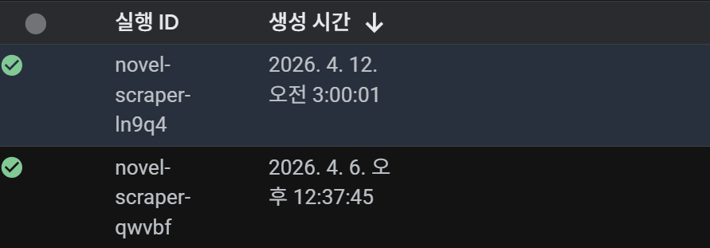
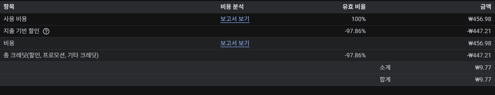

## • 시작점: 최소 비용으로 굴러가는 '트렌드 공장' 짓기

이전 포스트에서도 은근슬쩍 고백했지만, 제 모든 딴짓(?)의 기저에는 귀찮음을 극복하고 싶은 팩토리오식 마인드가 깔려있습니다. 이번 프로젝트 역시 세상을 놀라게 할 거창한 분석기를 만들겠다는 목적보다는, 그저 **원시 데이터(Raw Data)를 파이프라인에 툭 집어넣었더니 알아서 정제된 정보(Insight)로 튀어나오는 전면 자동화 공정을 장난감처럼 조립해 보고 싶었다**는 꽤 소박한 동기에서 출발했습니다.

처음에는 이 '자동화 장난감'에 어떤 데이터를 집어넣고 테스트해 볼까 고민했습니다. 기왕 파이프라인을 짓는 김에 수치만 가득한 재미없는 데이터보다는, 제 개인적인 취미의 영역에서 주제를 골라보는 것이 훨씬 흥미로울 것 같더군요. 현재 제 취미 생활의 지분은 정확히 **'절반은 게임, 나머지 절반은 서브컬처 웹소설'**로 양분되어 있는데, 마침 매일 수백 편씩 새로운 글이 쏟아지고 시시각각 인기 키워드가 변하는 **'웹소설 시장'**이야말로 파이프라인에 얹어서 돌려보기 가장 완벽한 원석이었습니다.

물론 그 이면에는 이처럼 방대한 시장의 트렌드를 제 손가락 관절과 체력을 소모해가며 직접 눈으로 모니터링하기엔 너무 귀찮다는 본심도 컸습니다.

특히 이 공장을 설계하며 가장 신경 쓴 핵심 모티베이션 중 하나는 **'자동화 유지비용(Cost)의 극한적 최소화'**입니다. 아무리 좋은 파이프라인을 짓더라도 매달 서버비가 꼬박꼬박 빠져나간다면 개인 차원의 취미로는 배보다 배꼽이 더 큽니다. 그래서 구글 클라우드(GCP)가 제공하는 넉넉한 **무료 티어(Free Tier) 범위 내에서 크롤링부터 데이터베이스(Firestore) 적재, 스케줄링까지의 전체 공정을 100% 무료로 굴러가도록 설계**해 보는 것 역시 중요한 도전 과제이자 재미 요소였습니다.

---

## • 전체 워크플로우 소개: 과거에 공부했던 데이터 파이프라인의 응용

이 워크플로우의 뼈대는 사실 제가 예전에 개인적으로 공부하며 익혀뒀던 **빅데이터 수집 및 분석 워크플로우**의 기본기를 서브컬처 도메인에 맞춰 참조하고 응용한 것입니다. 정석적인 데이터 처리 논리를 소설 트렌드 수집 파이프라인에 적용한 전체 흐름은 다음과 같이 전개됩니다.

1.  **데이터 수집 (Data Ingestion):** 수집의 핵심 타겟은 문피아, 조아라 등 주요 모바일 플랫폼의 **'주간 베스트 100위 차트'**입니다. 단순히 리스트만 긁어오는 것이 아니라, **주간 순위, 해당 작품의 제목, 장르 및 서사 태그, 선호(즐겨찾기) 수, 누적 조회수, 추천수, 그리고 등록된 편수(챕터 수)**까지 개별 작품의 가치를 증명하는 7대 핵심 메타데이터를 일괄적으로 스크래핑합니다.
2.  **데이터 정제 및 클라우드 적재 (Storage):** 크롤링 중 발생하는 동적 HTML 노이즈를 완전히 걷어내고 정형화된 데이터셋으로 묶어낸 뒤, 이를 NoSQL 기반의 클라우드 데이터베이스(GCP Firestore)에 타임스탬프와 함께 스냅샷 형태로 안전하게 아카이빙합니다.
3.  **트렌드 분석 및 시각화 (Analysis & Visualization):** 적재된 주간 데이터를 횡단 분석하여 어떤 키워드가 새롭게 100위권에 진입했는지, 어떤 태그 그룹이 차트에서 밀려나며 반응을 잃었는지를 추적합니다. 이 지표들은 단순한 로그를 넘어 직관적으로 시장의 맥락을 읽을 수 있도록 대시보드 차트 형태로 시각화 처리됩니다.
4.  **콘텐츠 자동 생성 및 스케줄링 배포 (Generation & Delivery):** 최종 결과물 역시 자동화됩니다. 시스템은 1주일에 한 번, 추출된 트렌드 인사이트를 AI 에이전트(작성 워커)에게 주입하여 블로그 포스트 초안과 숏폼(Short-form) 영상용 스크립트를 스스로 작성해 둡니다. 인간(저)의 개입은 **매주 일요일 단 하루, 생성된 결과물을 최종 검토 및 승인하는 과정**뿐이며, 검토가 끝난 콘텐츠는 설정된 큐에 따라 요일별로 순차 발행됩니다.

이번 포스트에서는 그 첫 번째 페이즈인 **스크래퍼 모듈의 고도화 작업과 클라우드 인프라(GCP) 이식 과정**을 다룹니다.

---

## • 크롤링의 벽: robots.txt와 가상 브라우저 우회

스크래핑 개발을 시작하자마자 마주한 가장 큰 장벽은 각 플랫폼의 강력한 **'크롤링 차단(Anti-Bot)'** 정책이었습니다. 문피아나 조아라 같은 플랫폼들은 기본적으로 `robots.txt`를 엄격하게 설정하거나, 비정상적인 접근 패턴을 감지하여 봇(Bot) 트래픽을 원천 차단하고 있었습니다.

플랫폼이 이렇게 문을 걸어 잠그는 이유는 명확합니다. 악의적인 텍본 추출 프로그램이나 경쟁사가 무자비하게 트래픽을 쏘아대면 서버 연산 비용이 폭증하고 치명적인 저작권 침해로 이어지기 때문입니다. 

하지만 제 파이프라인은 소설 본문 전체를 훔치거나 상업적으로 악용하는 것이 아닙니다. 단순히 1주일에 한두 번, 베스트 100위권의 껍데기(메타데이터 통계)만 살짝 읽어내려가는 비상업적 개인 연구 목적입니다. 비록 서비스 약관이나 로봇 배제 표준 측면에서는 다소 회색지대(Gray Area)에 놓여 있다 하더라도, 물리적인 서버 과부하를 초래하지 않고 철저히 간헐적으로만 수집하므로 실질적인 문제가 되지는 않으리라 판단했습니다.

이 차단을 넘어서기 위해 단순한 HTTP 웹 요청(Requests) 방식은 폐기하고, **Playwright** 기반의 가상 브라우저(Headless Chromium)를 전면에 내세웠습니다.

*   **동적 렌더링 파훼 및 봇 탐지 우회:** 문피아(Munpia)의 경우, 단순히 페이지를 요청하면 소개 콘텐츠나 챕터 수가 유실된 문서 구조를 리턴합니다. 이를 뚫기 위해 Playwright로 브라우저를 띄우되, `--disable-blink-features=AutomationControlled` 플래그를 주입하고 평범한 PC 버전의 크롬 유저 에이전트(User-Agent)로 위장시켜 안티봇 시스템의 의심을 피했습니다. 이후 화면이 브라우저 상에 완전히 렌더링 될 때까지 충분히 대기한 후 DOM 트리를 긁어오는 방식으로 데이터 유실을 극복했습니다.
*   **지연 시간 제어와 병렬 프로세싱:** 사람의 행동처럼 보이기 위해 페이지 이동 간에 적당한 텀(`waitForTimeout`)을 두도록 로직을 짰기 때문에, 필연적으로 단일 수집 속도는 떨어지게 됩니다. 이를 상쇄하기 위해 여러 가상 브라우저 세션이 컨테이너의 가용 리소스 범위 안에서 병렬(Parallel)로 동작하도록 아키텍처를 구성하여 전체 수집 소요 시간을 단축 방어했습니다.

---

## • 구글 클라우드(GCP)와 Firestore 연동

방대한 트렌드 데이터가 온전히 통제된 환경에서 무료로 쌓이기 위해 전체 파이프라인을 구글 클라우드(GCP) 인프라로 이식했습니다.

*   **Local vs Firestore 스위칭 도구:** 로컬 환경에서 테스트할 때마다 클라우드 데이터베이스를 오염시키는 것을 막기 위해, CLI 플래그 하나만으로 '로컬 파일 보관 모드'와 'Firestore 프로덕션 저장 모드'를 즉각 전환할 수 있는 디버깅 제어기를 달았습니다.
*   **컨테이너 기반 클라우드 런타임 구축:** 완성된 스크래퍼 코드 및 Playwright 환경 일체를 도커(Docker) 컨테이너로 묶어 클라우드 런타임(Cloud Run)에 배포했습니다.
*   **GCP Cloud Scheduler 자동화:** 사용자 트래픽이 가장 한산하여 플랫폼의 방어 기제가 상대적으로 느슨하며, 한 주간의 차트 누적치가 가장 명확한 시간대인 **'매주 일요일 새벽 3시'**로 기동 스케줄(Cron)을 고정했습니다.

이제 매주 일요일 새벽 3시가 되면 GCP Cloud Scheduler가 알아서 데몬을 깨워 컨테이너를 돌립니다. 제가 깊게 잠들어 있는 사이에도 지난 한 주간 주간 베스트를 장식했던 수백 개의 웹소설 메타데이터가 백그라운드에서 자동으로 Firestore에 차곡차곡 적재되는 완전 자동화가 달성된 것입니다.

---

## • 자동화 런타임 테스트 실증

실제로 파이프라인을 클라우드에 배포한 뒤, 스케줄러가 데몬을 정상적으로 기동하고 데이터베이스에 스냅샷을 잘 쏘아 올리는지 확인한 모니터링 결과입니다.



가장 먼저 GCP 대시보드에서 `novel-scraper-ln9q4` 컨테이너가 목적했던 크론 스케줄인 **'2026년 4월 12일 일요일 오전 3:00:01'**에 한 치의 오차도 없이 백그라운드에서 기동된 것을 확인했습니다.

그리고 아래는 해당 시간대에 컨테이너 내부에서 찍힌 **실제 크롤러 구동 및 적재 로그**입니다.

```bash
...
[Novelpia] 99위 (명장은 로판을 배신하기로 했다) 상세 추출 완료
[Novelpia] 100위 (옥타곤 안의 몬스터) 상세 추출 완료
[Novelpia] 수집 완료: 100개 랭크 추출
--- [결과 요약] ---
노벨피아: 100개 유효 기록
문피아: 100개 유효 기록
조아라: 100개 유효 기록
--- [Phase 4.5] 통합 데이터 저장 ---
[HistoryManager] 데이터 처리를 시작합니다... (로컬 모드: false)
[HistoryManager] Firestore DB 적재 완료! (스냅샷 Timestamp: ...)
[HistoryManager] Firestore 네트워크 연결이 안전하게 종료되었습니다.
[성공] 크롤링 결과 저장이 처리되었습니다. (로컬 모드: false)
(서버리스 데이터 축적 모드로 전환됨)
✅ 모든 프로세스 정상 종료됨
Container called exit(0).
```

보시다시피 노벨피아, 문피아, 조아라 3개 플랫폼에서 각각 100개의 유효 랭크 데이터를 완벽히 스크래핑한 뒤, 클라우드 모드(`로컬 모드: false`) 상태로 Firestore DB에 스냅샷을 적재하고 우아하게 프로세스를 종료(`exit(0)`)하고 있습니다.

지루하게 로컬에서 수동으로 스크립트를 켜야만 했던 과거의 번거로움을 넘어, 어떠한 물리적 개입 없이 매주 알아서 거대한 트렌드 데이터 댐이 차오르는 서버리스(Serverless) 생태계가 안착했습니다.



**사족: 완전 무과금 서버리스의 함정? (청구액 10원)**

도입부에서 GCP 프리 티어를 활용해 '유지비용 0원'을 달성하겠다고 호언장담했습니다만, 막상 결제 보고서를 열어보니 **월 9.77원(약 10원)**의 비용이 부과되어 있었습니다. 

원인을 뜯어보니 런타임 자체 연산이나 Firestore 읽기/쓰기 요금은 모두 무료 범주 내에 안착했으나, 개발 과정에서 계속 Push 했던 **구버전 컨테이너 이미지들이 '서울 리전(asia-northeast3)'의 Artifact Registry에 누적되면서 미세한 스토리지 보관 비용이 발생**한 것이었습니다. 

이 저장소를 100% 무료 혜택이 적용되는 미국(US) 리전으로 옮기면 완벽한 0원 결제가 가능하긴 합니다. 하지만 한 달에 10원, 1년을 팽팽 돌려도 120원이 나오는 작디작은 금액을 타파하겠다고 잘 도는 파이프라인을 뜯어 미국으로 이사시키는 것은 제 인건비(귀찮음)가 더 든다는 계산이 나왔습니다. 결국 이 정도 '인프라 유지비'쯤은 기분 좋게 구글에 쾌척하며 넘어가기로 했습니다.

---

## • 다음 여정: 방대한 텍스트에서 '인사이트' 깎아내기

이로써 기초적인 '지식 댐(Data Dam)'이 완공되었습니다.

다음 포스트에서는 이렇게 Firestore에 모여든 방대한 로그(태그 조합, 작품 소개글 등) 데이터를 어떻게 분석할지 다룰 예정입니다. 단순한 빈도수 추출을 넘어, RAG 등 AI 워크플로우를 결합하여 매주 '주간 트렌드 핵심 요약'을 자동으로 뱉어내는 인사이트 도출 시스템의 개발 과정을 준비해 오겠습니다.
